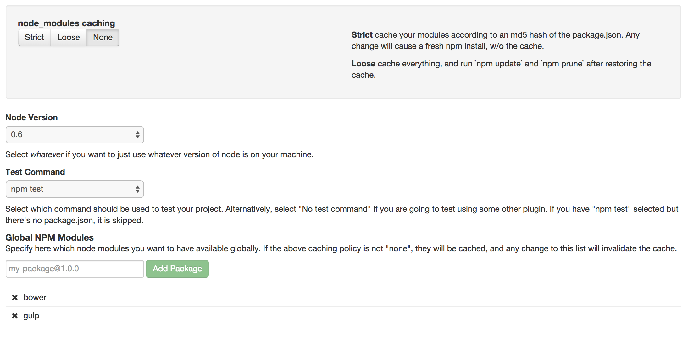

# Strider Titanium

Run Titanium unit tests in strider.

NOTE: this project is a fork of strider-node and is not yet fully working

## To-Do
- Pull list of Titanium SDK versions
- Run TiMocha tests
- Run Ti Calabash tests
- Select box to choose devices or simulators
- Add support for testing native modules
- Add support for testing alloy widgets

